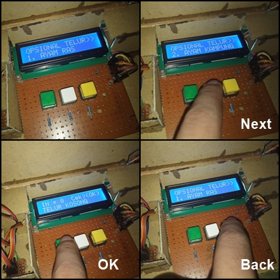

# INO-Arduino-Sorting-Quality-Of-Chicken-Egg
Alat Pendeteksi dan Penyortir Kualitas **Telur Ayam**.  

**Alat ini merupakan Prototipe dalam Project Skripsi saya dulu ketika menempuh pendidikan S1 Teknik Informatika. Menggunakan desain sistem conveyor sehingga telur akan berjalan sendiri menuju ruang sensor, dan setelah itu akan dilakukan sorting menggunakan dua palang pintu yang digerakan menggunakan dua buah servo.**  

## Penjelasan Fitur Singkat
- Telur yang dapat diperiksa adalah jenis telur Ayam Ras dan Ayam Kampung.
- Terdapat menu yang berguna untuk Opsional pemilihan Sorting Pemeriksaan pada **Telur Ayam Ras** atau **Ayam Kampung**.
- Menampilkan jumlah hasil pemeriksaan telur dengan kualitas baik dan juga kualitas buruk
- Palang penyortiran akan otomatis bergerak menyesuaikan hasil dari pemeriksaan kualitas telur.

## Bahan-bahan Utama
- Arduino Uno
- 3 Buah Tombol Jenis Tactile
- LCD I2C 16x2
- 2 Buah Sensor LDR
- Sensor IR Proximity
- Motor Driver L298N + Motor Gearbox
- 2 Buah Servo TowerPro Sg90
- Lampu LED

## Pin Config Arduino
### 🔻 Arduino 👉 Tombol
- 8 => Tombol-1 (Ok)
- 9 => Tombol-2 (Next)
- 10 => Tombol-3 (Back)

### 🔻 Arduino 👉 LCD I2C
- SDA => SDA
- SCL => SCL

### 🔻 Arduino 👉 LDR
- A1 => KakiLDR-1
- A2 => KakiLDR-2

### 🔻 Arduino 👉 IR Proximity
- 7 => Out

### 🔻 Arduino 👉 L298N
- 5 => IN3
- 4 => IN4
- 3 => ENB

### 🔻 Arduino 👉 Servo1 & Servo2
- 11 => Data Servo-1
- 12 => Data Servo-2

### 🔻 Arduino 👉 LED
- 13 => VCC Led

## Skematik

## Spill
- Prototipe Keseluruhan 

- Rancangan  
